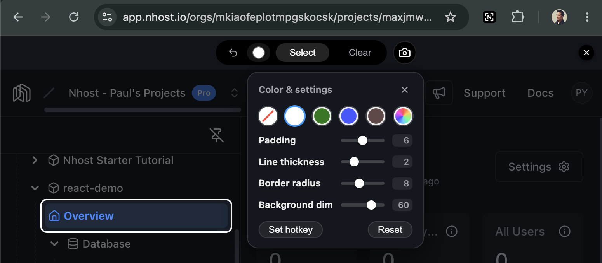

# Nshot - Screenshot Tool

<a href="https://drive.google.com/file/d/1hkXG29Z5PswaRmePoxRNvnV4wQ8j8Bxs/view" target="_blank" rel="noopener noreferrer"></a>

▶ <a href="https://drive.google.com/file/d/1hkXG29Z5PswaRmePoxRNvnV4wQ8j8Bxs/view" target="_blank" rel="noopener noreferrer">Watch the demo</a>

**Nshot** is a Chromium extension for composing screenshots of any page. It shows a control toolbar **above**
the page (it pushes the page down rather than overlaying it) where you can
**dim** the background, **spotlight** (cut out) chosen elements, and draw an
accent **outline**, then capture the visible viewport and **crop**, **save**,
**download**, or **copy** it.

It runs as a Chrome extension because that is the only way to read and
manipulate a page's real DOM/CSS while bypassing strict CSPs (content scripts
run in a privileged context). Nothing is injected into any app bundle — Nshot
only touches a page while you have the extension loaded and toggled on.

## Features

- **Toggle hotkey** — **Ctrl/Cmd+Shift+S** (or click the extension's toolbar icon) shows/hides the tool on the current tab. It is a browser-global command handled by the service worker, so it works on any tab without opening the tool first. Rebind or disable it at `chrome://extensions/shortcuts`; the **Hotkey** button in the settings popover opens that page directly.
- **Spotlight** — in **Select** mode, click a page element to cut it out of the dim so it stays bright. The element you click becomes the **active** selection: changing the color/padding/thickness/radius then updates it live, until you select another element. **Shift+click** builds a multi-select group so a setting change hits every element in it at once. When elements picked in the **same Shift+click group touch or overlap**, they render as a single large box (one continuous cutout and one outline) instead of several small boxes with dim seams between them; picks made in separate clicks never combine, even if they touch. Click a spotlit element again (with the current settings unchanged) to remove it; if the settings differ, the click re-applies them instead.
- **Auto dim** — there is no dim button: the page dims automatically whenever the spotlight is in use (while picking, or whenever at least one element is selected), and the dim survives into the capture.
- **Outline** — draw an accent border around each spotlit element; pick the color from the recent-color circles or a custom color picker.
- **Settings** — a popover (the color swatch button) with the color circles plus **Padding**, **Line thickness**, **Border radius**, and **Background dim** sliders. **Reset** restores the sliders to defaults; **Clear history** forgets saved spotlights, undo history, and recent colors across every page.
- **Undo** — step back one change while in Select mode: a pick, an unpick, a **Clear**, or a live settings edit (a completed slider adjustment or color pick applied to the active selection).
- **Capture** — grab the visible viewport (the toolbar hides itself and the page push-down is dropped first) into a save modal.
- **Crop** — in the save modal, drag a region of the captured image and **Apply** to crop; **Reset crop** restores the original capture.
- **Save as / Download / Copy** — native save dialog, one-click timestamped download, or PNG to the clipboard.
- **Persistence** — settings, recent colors, the spotlight selection, and whether the toolbar is open are remembered across reloads. The toolbar always re-opens in **read** mode, never straight into Select (see [Persistence](#persistence)).

## Browser compatibility

This extension is built using the standard Chrome Extensions API and can be sideloaded in most Chromium-based browsers, including:

- Google Chrome
- Microsoft Edge
- Brave
- Vivaldi
- Opera
- Arc
- Chromium

## Build & install (load unpacked)

```bash
pnpm install --ignore-workspace   # standalone; not part of the pnpm workspace
pnpm build                        # bundles src/ -> dist/
```

Then in Chrome:

1. Open `chrome://extensions`.
2. Toggle **Developer mode** (top right).
3. Click **Load unpacked** and select `tools/screenshot-extension/dist`.

After pulling changes, re-run `pnpm build` and hit the reload icon on the
extension card. Use `pnpm watch` to rebuild on save (then reload the card).

## Usage

Press **Ctrl/Cmd+Shift+S** (or click the extension's toolbar icon) to toggle the
tool on the current tab. The toolbar floats at the top and pushes the page down
rather than covering it; its controls are centered, with a clear **✕** pinned to
the right to exit.

### Toolbar controls

- **Select** (center) — enter/leave spotlight mode. While picking, click a page
  element to spotlight it (it becomes the active selection); **Shift+click** to
  spotlight several at once as a group (elements picked together in one group
  that touch merge into one large box); click a spotlit element again to remove
  it. **Esc** stops picking.
- **Undo** (left, in Select mode) — step back one change: a pick, an unpick, a
  **Clear**, or a live settings edit applied to the active selection. Each
  settings change is one step: a whole slider drag collapses into a single undo
  (the value where you let go, or the number you typed), plus swatch picks and
  custom colors. Enabled only while in Select mode and only when there is a
  prior state to return to.
- **Color & settings** swatch (left) — opens the settings popover (see below).
  The swatch shows the current outline color.
- **Clear** (right) — remove every spotlight at once (itself undoable).
- **Capture** (camera, right) — take the screenshot and open the save modal.

Dimming is automatic — there is no dim button. The page dims whenever the
spotlight is in use (while picking, or whenever at least one element is
selected), so the dim is present in the captured image.

### Settings popover

Open it from the color swatch button. It holds the color circles on top and four
sliders below, then a footer row with **Hotkey**, **Clear history**, and **Reset**.

Drag the popover by its header to move it; the position is **remembered**, so
toggling it off and on reopens it in the same spot. Only the **X** (close) button
resets it back to the default spot under the swatch. Leaving select mode (via
**Esc** or the **Select** button) keeps its position and remembers whether it was
open — returning to select mode reopens it if it was open, and leaves it closed
if it wasn't.

Setting changes are **live**: they update the currently selected element (or the
whole Shift+click group) as you drag, and they also seed the *next* element you
spotlight. Every other spotlit element stays frozen at the values it was last
given, so editing one selection never disturbs the rest. Selecting a different
element (a plain click) moves the live edits to it.

- **Color circles** — the first circle is always **Transparent** (an on-screen
  dashed guide that is omitted from the capture, i.e. "no outline"). The next
  circles are the **last 4 recently-used colors**, most recent first (white
  seeds the list by default). The last control is a **custom color picker**;
  picking a color promotes it to the front of the recent list.
- **Padding** — extra breathing room around each spotlit element.
- **Line thickness** — outline border width.
- **Border radius** — corner rounding of the cutout and outline.
- **Background dim** — dim strength (shown as a percentage).

Each slider snaps to a few discrete stops while dragging, but you can **click its
numeric readout to type a custom value** within the slider's allowed range
(Padding 0–99, Line thickness 1–99, Border radius 0–99, Background dim
0–99%). **Enter** commits the typed value; **Esc** cancels the edit.

**Hotkey** opens `chrome://extensions/shortcuts` so you can rebind or clear
the toggle shortcut. **Reset** returns the four sliders to their defaults and
leaves the current color as-is (the saved color history is untouched too); it is
disabled when the sliders are already at their defaults.

**Clear history** (the middle footer button) wipes everything
Nshot remembers: the spotlight selections and their undo history on **every**
page, the recent-colors list, and the current outline color (reset to white).
The four sliders are left alone — use **Reset** for those. It is disabled when
there is nothing remembered to clear.

### Capture & the save modal

**Capture** hides the toolbar (including the color/settings popover, which would
otherwise bake into the shot) and drops the page push-down first, then grabs the
visible viewport via `chrome.tabs.captureVisibleTab` — pixel-perfect, viewport
only (full-page stitching is not implemented yet). It opens the save modal, which
has a filename field, the captured-image preview (click to expand full-screen),
a crop row, and the **Save as / Download / Copy** actions.

#### Cropping

The crop row sits below the preview. Press **Crop** to enter crop mode: a
selection appears covering the whole image, outlined with an animated
marching-ants border — drag its edges or corners (or drag a new region) to shrink
it. **Apply** re-renders the cropped pixels as the new
image; **Cancel** leaves crop mode without changing anything. Once cropped,
**Reset crop** restores the original, untouched capture. Save/Download/Copy are
disabled while cropping, so the only choices are Apply or Cancel.

#### Save targets

- **Save as** opens the browser's native save dialog, so you choose any location
  and confirm the filename (defaults to `screenshot-<timestamp>.png`).
- **Download** writes that same flat, timestamped file straight to the browser's
  download directory — no dialog.
- **Copy** puts the PNG on the clipboard.

## Persistence

State is kept in the page's own storage (per-origin), validated on read, and
best-effort (failures are ignored). There is no syncing across machines. The
**Clear all history** button in the settings popover wipes the spotlight/color
state below in one go (the persisted slider settings stay put).

- **`localStorage` (survives across browser sessions, shared by origin):**
  - Settings — padding, line thickness, border radius, background dim.
  - Current outline color and the **recent-colors** list (up to 4).
- **`sessionStorage` (per-tab; cleared when the tab closes):**
  - Whether the toolbar is **open** — so a full page reload re-opens it where it
    was, without leaking the open state to other tabs. It always re-opens in
    **read** mode; Select mode is never persisted, so a reload or a fresh
    toggle-on never drops you straight into picking.
  - The **spotlight selection** and its **undo history**, keyed per pathname.
    Each pick is stored as a robust CSS selector plus the color/padding/thickness/
    radius chosen for it, then re-resolved on the next activation — so picks
    survive reloads and round-trip navigations (click a link, come back).
    Because a single-page app may not have rendered the picked nodes yet when
    the tool restores, resolution retries as the DOM settles (up to ~5s, and
    without clobbering the stored set) so late-rendered targets aren't lost.
    Elements that still don't exist after that window are skipped on restore.

## Prototype the UI fast (no extension reload)

Most of the tool is plain DOM/CSS in a ShadowRoot — only capture and download
touch Chrome APIs. To iterate on the toolbar/modal look without
rebuilding and reloading the unpacked extension:

```bash
pnpm dev      # serves dev/harness.html with esbuild live-reload
```

Open `http://localhost:5500/harness.html`. It mounts the **real** toolbar with
the Chrome calls stubbed (capture returns a placeholder image; download/save-as
trigger a normal browser download). Editing `src/content/*.ts` reloads the page
instantly.

This can't exercise the real `captureVisibleTab` or the native save dialog, so
still load the unpacked extension to verify the actual capture/save flow.

The real extension deliberately **skips** the harness pages (`harness.html` and
`harness2.html`) — via the manifest `exclude_matches` and a matching guard in the
background worker — so its content script never stacks a second toolbar on top of
the harness-mounted one, even with the extension loaded and the dev server open.

## Layout

| Path | Purpose |
| --- | --- |
| `manifest.json` | MV3 manifest (copied into `dist/` at build) |
| `icons/` | Extension icon (`icon.svg` source + 16/32/48/128 PNGs, copied into `dist/` at build) |
| `src/background.ts` | Service worker: toggle/inject, captureVisibleTab, downloads |
| `src/content/index.ts` | Injected entry; wires the toggle message to the toolbar |
| `src/content/ui.ts` | Toolbar + save-modal DOM (ShadowRoot) |
| `src/content/overlay.ts` | Dim / spotlight / outline effect engine |
| `src/content/styles.ts` | ShadowRoot-scoped CSS |
| `src/content/capture.ts` | Capture/clipboard/download message helpers |
| `src/content/messages.ts` | Message protocol shared by content + background |
| `dev/serve.mjs` | Live-reload dev server (esbuild watch + serve) for the harness |
| `dev/harness.{ts,html}` | Dev page that mounts the toolbar with Chrome APIs stubbed |
| `dev/make-icons.mjs` | Icon pipeline: render SVG → PNG sizes (+ `--watch` live preview) |
| `dev/icons.html` | Icon preview page (true PNGs, light/dark, mock toolbar) |
| `icons/icon.svg` | Icon source; PNGs are baked from it by `pnpm icons` |
